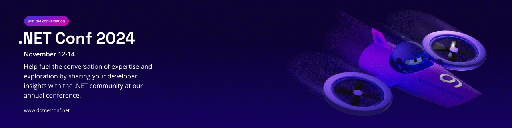

# .NET Conf 2024

.NET Conf 2024 is scheduled for November 12-14 and broadcast live on [YouTube](https://youtube.com/dotnet) and [Twitch](https://twitch.tv/visualstudio), with a player available on our website at [dotnetconf.net](https://dotnetconf.net).

This is the largest community event for the .NET ecosystem with [creative](https://github.com/dotnetConf/2024/tree/main/Creative) and educational materials available from our live and recorded sessions.  We encourage you to use the creative assets and content to help present your own sessions as well as events locally for your colleagues and community.
